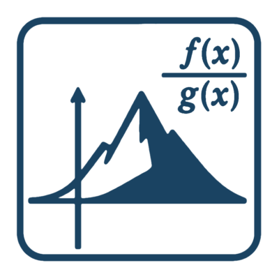

 This repository is a collaborative space designed to bring together information about the many software packages, tools, and libraries related to rational approximation in one centralized location. Whether you're working on interpolation, best approximation, model reduction, or other related areas, our goal is to create a comprehensive and accessible directory of available software.

We invite researchers, developers, and enthusiasts to contribute by sharing their own tools or pointing to existing ones—helping the community stay connected and informed.

# Overview of software for rational approximation

| Package name | Contributors / Contact info | Language(s) | Description | Documentation | Reference work | Citing | License | Latest update | 
|:------------:|:-----------:|:-----------:|:-----------|:-----------:|:-----------:|:-----------:|:-----------:|:-----------:|
| [aaa.m](https://github.com/chebfun/chebfun/blob/master/aaa.m) | [Nick Trefethen](https://github.com/trefethen), Yuji Nakatsukasa | MATLAB | AAA algorithm for rational approximation. Distributed with Chebfun but runs independently. | [guide](https://www.chebfun.org/docs/guide/guide04.html) | [Nakatsukasa et al.](http://epubs.siam.org/doi/10.1137/16M1106122) | [Nakatsukasa et al.](http://epubs.siam.org/doi/10.1137/16M1106122) | BSD-3 | August 2024 |
| [RationalFunctionApproximation.jl](https://github.com/complexvariables/rationalfunctionapproximation.jl/) | [Toby Driscoll](https://github.com/tobydriscoll)  | Julia | Rational appproximation of functions in the complex plane. | [yes](https://complexvariables.github.io/RationalFunctionApproximation.jl/stable/) | n/a | [see file](https://github.com/complexvariables/RationalFunctionApproximation.jl/blob/main/CITATION.cff) | MIT | April 2025 |
| [MORLAB](https://www.mpi-magdeburg.mpg.de/projects/morlab) | Peter Benner, Jens Saak, [Steffen W. R. Werner](mailto:steffen.werner@vt.edu)  | MATLAB / Octave | Model order reduction methods in MATLAB and Octave. | [yes](https://morwiki.mpi-magdeburg.mpg.de/morwiki/index.php/MORLAB) | [yes](https://doi.org/10.1007/978-3-030-72983-7_19) | [see file](https://cscproxy.mpi-magdeburg.mpg.de/mpcsc/software/morlab/6.0/CITATION.md) | BSD-2 | September 2023 |
| [Chebfun](https://chebfun.org/) | [Nick Trefethen](mailto:trefethen@seas.harvard.edu), [Nick Hale](mailto:nickhale@sun.ac.za)  | MATLAB | Numerical computing with functions. (See esp. `minimax` and `aaa`.) | [yes](https://www.chebfun.org/docs/) | [Chebfun guide](https://www.chebfun.org/docs/guide/) | [Chebfun guide](https://www.chebfun.org/docs/guide/) | BSD-3 | April 2025 |
| [pyMOR](https://pymor.org) | [Petar Mlinarić](https://github.com/pmli), [Stephan Rave](https://github.com/sdrave)  | Python | Model order reduction applications allowing implementations to work with different backends.| [yes](https://docs.pymor.org/) | [Milk et al.](https://epubs.siam.org/doi/10.1137/15M1026614) | [Milk et al.](https://epubs.siam.org/doi/10.1137/15M1026614)  | BSD-2 | December 2024 |
| [Lightning Laplace solver](https://people.maths.ox.ac.uk/trefethen/lightning.html) | [Nick Trefethen](mailto:trefethen@seas.harvard.edu) | MATLAB | Solution of Laplace and conformal mapping problems. | no | [Gopal and Trefethen](https://epubs.siam.org/doi/10.1137/19M125947X) | [Gopal and Trefethen](https://epubs.siam.org/doi/10.1137/19M125947X) | n/a | March 2020 |
| AAA in [SciPy](https://scipy.org) | [Jake Bowhay](https://github.com/j-bowhay) | Python | AAA algorithm for rational approximation. | [yes](https://docs.scipy.org/doc/scipy/reference/generated/scipy.interpolate.AAA.html) | n/a | [Virtanen et al.](https://scipy.org/citing-scipy/) | BSD-3 | August 2024 | 
| [baryrat](https://github.com/c-f-h/baryrat) | [Clemens Hofreither](https://people.ricam.oeaw.ac.at/c.hofreither/) | Python | Barycentric rational and polynomial interpolation and approximation with BRASIL and AAA. | [yes](https://baryrat.readthedocs.io/) | [Hofreither](https://doi.org/10.1007/s11075-020-01042-0) | [Hofreither](https://doi.org/10.1007/s11075-020-01042-0) | BSD-2 | February 2025 |
| [mLF](https://github.com/cpoussot/mLF) | [Athanasios C. Antoulas](https://antoulas.rice.edu/), Ion-Victor Gosea, [Charles Poussot-Vassal](https://sites.google.com/site/charlespoussotvassal/) | Matlab | Data-driven multivariate barycentric rational and polynomial interpolation. | [yes](https://github.com/cpoussot/mLF) | [Antoulas et al.](https://arxiv.org/abs/2405.00495) | [Antoulas et al.](https://arxiv.org/abs/2405.00495) to appear in SIAM Review | MIT | April 2025 |

